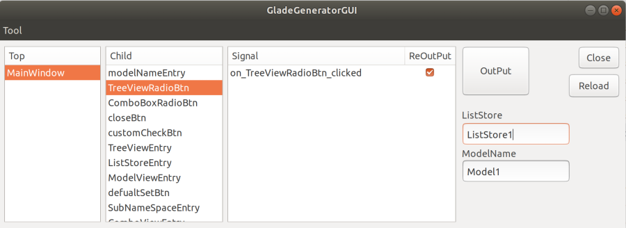
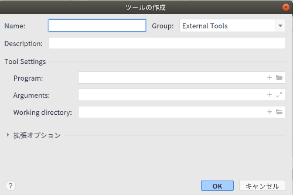
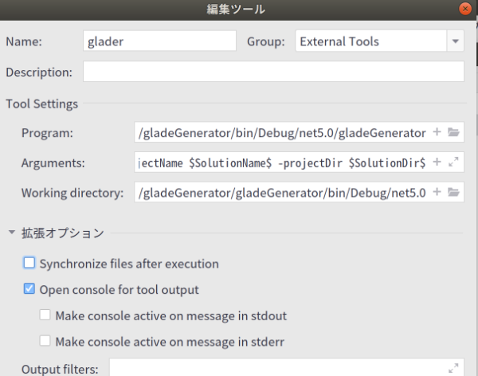
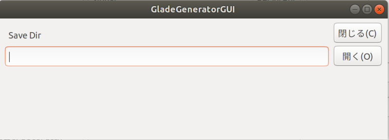

## Introduction

### GladeGeneratorGUI



### Rider Setting
ExploerPanel - right click - edit execution configuration - external tools


Set up external tools. Set the arguments



Uncheck Run after file sync.




### execution

TopMenu - Tool - ExternalTool

Right-click on the Exploer bar
You can run it from an external tool

### Arguments Macro Required

Set the path of the program
You must specify a macro
copy perst

``` Rider arguments macro require
-projectName $FilePath$ -fileDir $FilePath$ 
```

The working directory can be empty.

#### Description

projectName Used for the namespace of the exported program. Rider doesn't have a macro for namespaces, so we need to fill in ProjetctPath
fileDir The file or folder selected in Rider's explorer.

#### App launch


### App Description

OutPut Button Automatically generate programs

ReOutPut Button

If checked, re-write.If you do not want to export, uncheck the box.

Tool Button - Opens the settings screen.

### Settings Screen

Specify the location where you want to save the program



### Execution

Specify the grade and right-click to execute.


### ConfigSetting.xml
```
<Setting  isCodeHint ="true" codeHitFolder="codeHint" />
```

isCodeHint    We will also export a sample of the code when we export it.
codeHitFolder Name of the folder with the code samples

CodeHint can be customized

### template.txt
The contents of the exported class can be changed

### Automatic generation of declarations
Every time you add a control to the Glade file, a declaration statement is added


````
using System;
using Gtk;
Using UI = Gtk.Builder.ObjectAttribute;
namespace testGtkApplication
{
    partial class MainWindow
    {    
		//[UI] private readonly Gtk.Window MainWindow = null;
		[UI] private readonly Gtk.Box sdfsdfsd111 = null;
		[UI] private readonly Gtk.Button _button1 = null;		
    }
}
````

### Auto-generated content

### Automatic generation of event handlers
Every time you add a signal to the control, an event handler statement is added.

```
using System;
using Gtk;
Using UI = Gtk.Builder.ObjectAttribute;
namespace testGtkApplication
{
    partial class MainWindow
    {
	    private void on__button1_Clicked(object sender , EventArgs e){
			
	    }	    
    }
}
````

````
partial class MainWindow
````

Add "partial" before "class" in the class file you want to use

````
Use the IntelliSense feature in the name field of the handler of the grade
````
Enter 'On' in the Name field of the grade handler. IntelliSense will work.

### Environment
.net5

GtkSharp

Rider

ini-parser

System.CodeDom
